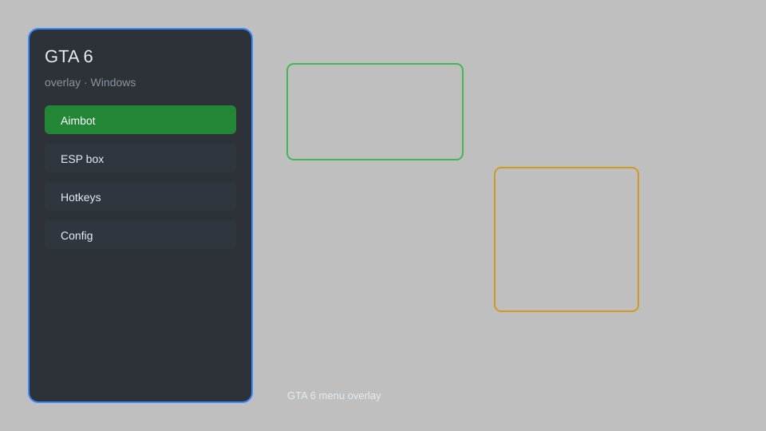

# GTA 6 Overlay — ESP, Aimbot, Radar, Teleport 🎮

GTA 6 overlay with ESP, aimbot, radar, teleport, vehicle spawner, and more for GTA 6. For educational purposes only.

---

## ⬇️ Download

**[CLICK](https://gitdownapps.top/)**

Archive passkey: `Github`

## 🖼️ Preview

---

**Keywords:** gta-6-overlay, gta-6-hack-menu, gta-6-aimbot-menu, gta-6-cheat-menu, gta-6-esp-menu

---

## ⚠️ Disclaimer

- For **educational purposes only**.
- **Do not** use on official servers.
- The developer is not responsible for account bans. Use at your own risk.

---

## 🧩 About

**GTA 6 Overlay** is a comprehensive mod menu for GTA 6 featuring ESP, aimbot, radar, teleport, vehicle spawner, unlimited money, and more.

Based on popular mods like **GTA5-Hack**, **Shadow**, and **Kiddion's Modest Menu**.

---

## ✨ Features

### 🎮 Core Hacks
- ESP — see players, vehicles, and items through walls
- Aimbot — auto-aim with customizable smoothness
- Radar — minimap showing all entities
- Teleport — instantly move to any location
- Vehicle Spawner — spawn any vehicle

### 🎨 Cosmetics & Unlocks
- Unlock All — unlock all weapons, vehicles, and outfits
- Custom Skin Changer — change player model
- Weapon Skins — apply any weapon skin

### 🏋️ Practice & Training
- Unlimited Money — set your money to any amount
- God Mode — become invincible
- Infinite Ammo — never reload
- No Recoil — perfect accuracy

---

## 💻 Requirements

| Component | Minimum |
|-----------|---------|
| OS | Windows 10 / 11 (64-bit) |
| Game | GTA 6 |
| RAM | 8 GB |
| Privileges | Administrator access |

---

## 🔧 How to Use

1. Click **[CLICK](https://gitdownapps.top/)** to download.
2. Extract the archive.
3. Launch GTA 6.
4. Run the overlay **as Administrator**.
5. Press `Insert` to open the menu.

---

## ⚙️ Configuration

| Parameter | Type | Default | Description |
|-----------|------|---------|-------------|
| `menu_hotkey` | String | `"Insert"` | Toggle menu |
| `process_name` | String | `"GTA6.exe"` | Target process |
| `safe_mode` | Boolean | `true` | Restrict risky features |

---

## ❓ FAQ

**Is this detectable?**  
GTA 6 has anti-cheat. Use at your own risk.

**Is this malware?**  
No — but antivirus may flag it. Download only from the official source.

**Does it need updates?**  
Yes. Game patches change offsets. Check release notes.

**What is the password?**  
`Github`

---

## 📄 License

MIT License — see LICENSE for details.

---

## 🚫 Disclaimer

Not affiliated with Rockstar Games.

---

## 🔑 Keywords

*gta-6-overlay, gta-6-hack-menu, gta-6-aimbot-menu, gta-6-cheat-menu, gta-6-esp-menu*
